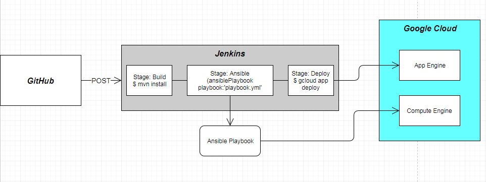
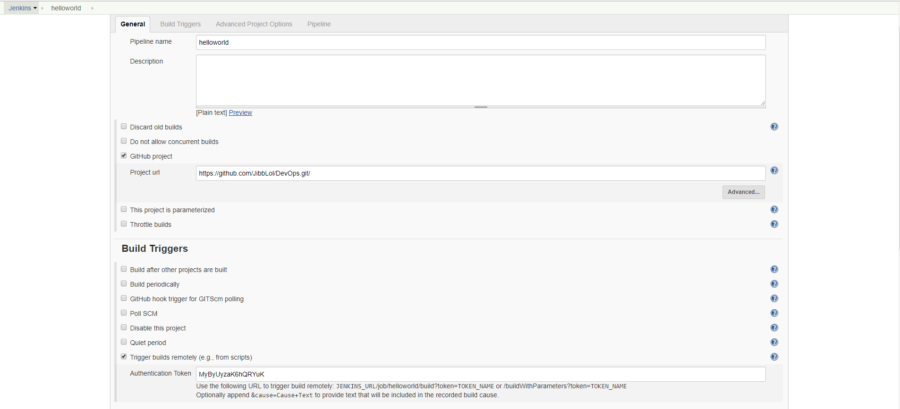
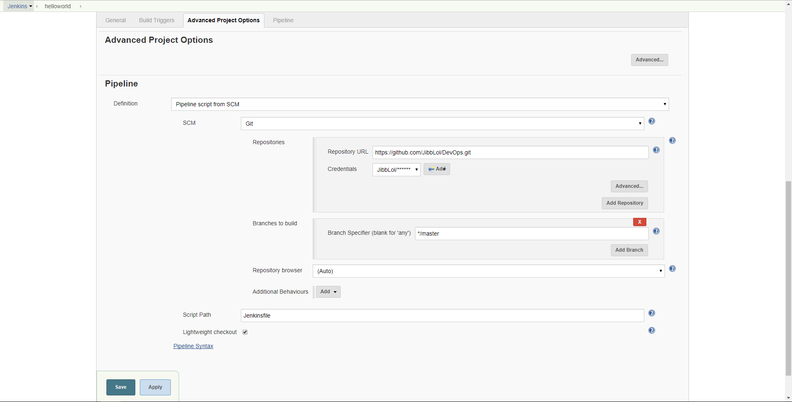
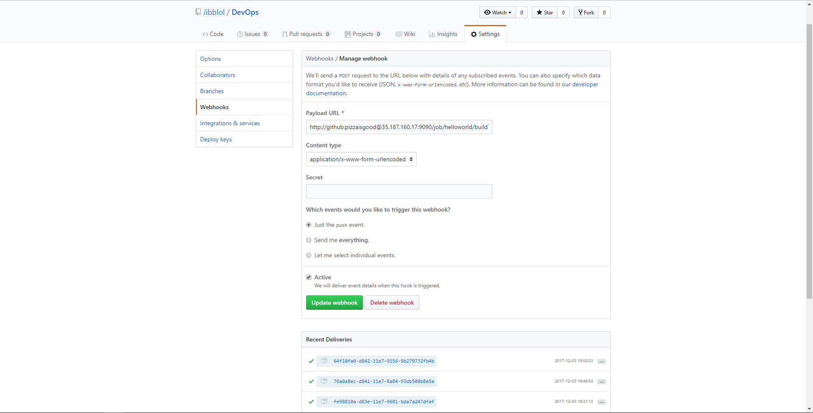

# Eksamen - DevOps i skyen - 2017

I denne oppgaven har jeg satt opp en løsning som bruker virtuelle maskiner, i Google Cloud, med Jenkins for bygging og utrulling av en applikasjon, og Ansible for konfigurasjonsstyring. Løsningen kjører Ubuntu 14.04.

Selve applikasjonen er, per i dag, kun en enkel HelloWorld-app. Den har ingen spesifikk funksjon.

# Jenkins

I min løsning valgte jeg å bruke Jenkins på en VM (compute engine) i Google Cloud. Grunnen til at jeg valgte nettopp Jenkins er at det er CI-verktøyet jeg har fått mest erfaring med gjennom semesteret. Prosessen med å sette opp og konfigurere pipelines er relativt enkelt, og det er god støtte for plugins. Deploymentprosessen er også veldig enkel når man arbeider med en såpass enkel applikasjon som i dette prosjektet. 

For å installere Jenkins fulgte jeg [Installing Jenkins on Ubuntu](http://wiki.jenkins.io/display/JENKINS/Installing+Jenkins+on+Ubuntu)

Jenkins tar seg av bygging og deployment av applikasjonen ved hjelp av en pipeline. Inne i Jenkins har jeg opprettet en "job" som vil trigge automatisk bygging av prosjektet ved push til GitHub. For å få til dette opprettet jeg en webhook i GitHub som sender en POST-request til Jenkins-jobben, og byggingen vil starte ved push til master-branch; altså har jeg tenkt at utvikling av applikasjonen bør skje på en egen test-branch før man pusher til master-branch I Jenkinsfilens stage "Deploy" vil jenkins rulle ut applikasjonen til en VM i Google App Engine. Fordelen her er at App Engine kjører 'docker build' automatisk gjennom kommandoen:
```sh
$ gcloud app deploy
```

### Skisse: Bygg-deploy-prosess


### Jenkins - Pipeline-setup




### GitHub-Webhook



# Ansible

Jeg har installert Ansible ved å følge http://docs.ansible.com/ansible/latest/intro_installation.html#latest-releases-via-apt-ubuntu. 
For å sette opp Ansible måtte jeg installere Ansible-plugin i Jenkins

| Plugin | URL |
| ------ | ------ |
| Ansible | [https://wiki.jenkins.io/display/JENKINS/Ansible+Plugin] [PlDb] |

I Jenkinsfilens stage "Ansible" kjører en ansible-task med 'playbook.yml'.

'playbook.yml'-filen kjører oppsett for en VM i Google Compute Engine.

Målet var å installere Docker på VMen med Ansible-playbook, så skulle Jenkins bygge docker-image og pushe det til cloud og til slutt skulle Ansible kunne kjøre
```sh
$ docker pull
```
og så oppstart av imaget. Jeg har dessverre ikke kommet så langt på grunn av tidsmangel, men på nåværende tidspunkt oppretter Ansible en VM i Google Compute Engine. Denne kan foreløpig ikke brukes til noe.

# Svakheter og forbedringspunkter
 - Jeg skulle gjerne ha fått til Ansible på en bedre måte. Helst vil jeg at Ansible skal laste ned docker-image fra Jenkins og rulle det ut på den nyoppstartede VMen.
 - Løsningen kunne gjerne hatt autoskalering i tilfelle det kommer mye trafikk.
 - Mangelfull varsling ved problemer/feil i jenkins-pipeline
 - Kjører pipeline på samtlige commits til GitHub. Burde heller kanskje brukt en release-mekanisme. Tilførsler til f.eks. readme vil trigge en full redeploy av applikasjonen.
 - Usikken med nåværende oppsett om applikasjonen får nedetid noe sted deployprosessen. I en produksjonsløsning ville man kanskje hatt en loadbalancer mellom flere instanser og bare tatt ned én om gangen, og skyve trafikken på de(n) som er oppe og går.


#  Flere kilder
- https://cloud.google.com/appengine/docs/flexible/nodejs/testing-and-deploying-your-app
- https://kubernetes.io/docs/tasks/tools/install-kubectl/
- https://cloud.google.com/solutions/jenkins-on-kubernetes-engine-tutorial
- https://jenkins.io/doc/book/pipeline/jenkinsfile/
- https://jenkins.io/blog/2017/02/07/declarative-maven-project/
